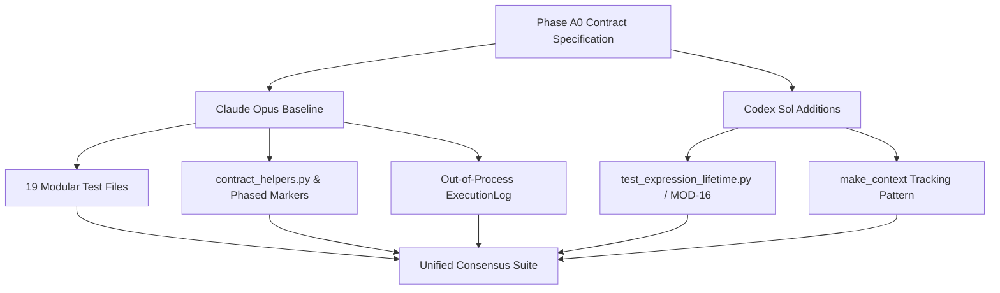
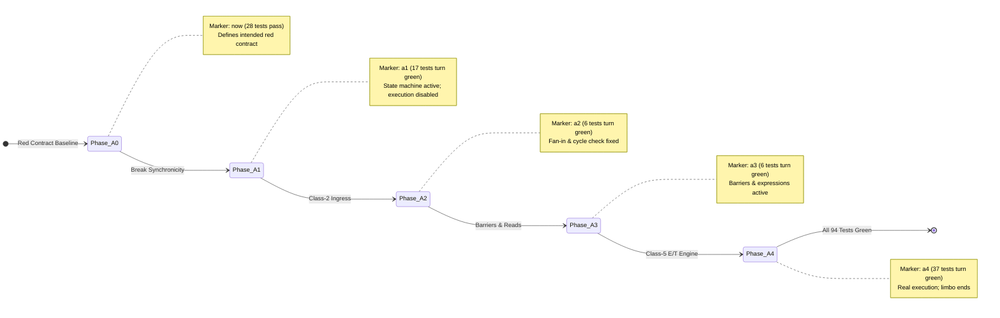

# Consensus Review: Phase A0 Contract Test Suite

**Author:** GitHub Copilot (Gemini 3.7 Flash)  
**Date:** 2026-08-25  
**Target Specification:** [seamless/attachments-and-mount-design.md](seamless/attachments-and-mount-design.md) (§15 Phase A0)  
**Target Output Path:** [seamless-workflow/tests/consensus-gemini.md](seamless-workflow/tests/consensus-gemini.md)  
**Evaluated Implementations:**
- Codex Sol: `seamless-workflow/tests/codex/`
- Claude Opus: `seamless-workflow/tests/claude/`

---

## 1. Executive Summary & Core Recommendation

Both Codex Sol and Claude Opus were tasked with implementing the test-suite creation half of **Phase A0** from [attachments-and-mount-design.md](seamless/attachments-and-mount-design.md), mining legacy tests from `~/legacy-seamless/tests` and generating tests across four specific directories:
1. `node-transition/`
2. `quiescence-barrier/`
3. `latency/`
4. `correctness/`

### The Bottom-Line Verdict
**Adopt Claude Opus as the structural and architectural baseline for the consensus suite, while integrating Codex Sol's critical [MOD-16] expression lifetime test and refining fixture lifecycle hygiene.**

Claude Opus produced an exceptionally mature, robust, and nuanced contract suite ($93$ tests across $19$ test modules) that strictly respects the phased migration model of the design document. It establishes a dedicated contract abstraction layer ([seamless-workflow/tests/claude/contract_helpers.py](seamless-workflow/tests/claude/contract_helpers.py)), uses fine-grained pytest phase markers (`now`, `a1`, `a2`, `a3`, `a4`, `slow`) to distinguish active regression nets from intended red contract tests, avoids polling pumps, uses out-of-process execution logging, and uncovered multiple latent defects in the existing codebase (notably an inverted graph cycle check).

Codex Sol delivered a clean, readable, but minimal smoke suite ($22$ tests across $8$ modules). While it covers the four requested directories, it frequently conflates multiple architectural phases into single test functions, reaches directly into private `_graph.nodes` internals, re-introduces the legacy `compute(timeout)` pump anti-pattern, and replaces live process-global singletons during cache resets. However, Codex implemented one vital test that Claude missed: **`test_expression_lifetime.py`**, which directly exercises the [MOD-16] `Expression.input_ref` claim defect.



### Key Consensus Actions
1. **Adopt Claude's directory layout, test decomposition, and helper architecture.**
2. **Incorporate Codex's `test_expression_lifetime.py` into `correctness/test_correctness_expression_lifetime.py`**, ported to Claude's phase marker and helper conventions.
3. **Incorporate Codex's `make_context` context-tracking pattern into [seamless-workflow/tests/claude/conftest.py](seamless-workflow/tests/claude/conftest.py)** to ensure all test Contexts are cleanly closed and unmounted, while maintaining Claude's safe in-place cache dictionary reset strategy (never replacing cache singletons).
4. **Fix minor edge cases in Claude's suite**, specifically the `Checksum` vs `None` tuple comparison in [seamless-workflow/tests/claude/correctness/test_correctness_expressions.py](seamless-workflow/tests/claude/correctness/test_correctness_expressions.py#L143-L149) and prerequisite checks for compiled C tests.
5. **Explicitly reject Codex's `compute(timeout=...)` parameter assertions** to preserve §14.2's invariant that graph quiescence barriers are pure completion predicates with no polling pump.

---

## 2. Phase A0 Mandate & Contract Obligations

According to [seamless/attachments-and-mount-design.md](seamless/attachments-and-mount-design.md) (§15 A0), the purpose of Phase A0 is:
> **"A red suite that describes the intended contract, and a green materialisation log that describes the current one."**

Phase A0 introduces **no runtime behavior changes**. It specifies the intended asynchronous, controller-mediated, content-addressed workflow model before synchronicity is deliberately broken in Phase A1 (entering the deliberate "limbo" where transformers do not evaluate inline).

### Essential Obligations of Phase A0 Tests
| Concern | Section / MOD | Mandatory Contract Guarantee |
|---|---|---|
| **Synchronicity Contract** | §14.1 | Eligibility is not delivery. Setting the last required pin leaves the node `computing` and its downstream cone `waiting`. No public operation returns a freshly computed result. |
| **Downstream Invalidation** | §8, §14.1 | Leaving `complete` revokes the entire downstream cone in the same non-yielding turn before anything is evaluated for firing. |
| **Cache Hit Invariant** | §14.1 | Even cache hits do not complete in-turn; they transition through side-work and settle via Class 5 notification one turn later. |
| **Quiescence Barriers** | §14.2, [MOD-17] | `ctx.compute()`, `await ctx.computation()`, `ctx.a.compute()`, and `await ctx.a.computation()` are completion predicates that never stall the controller's processed frontier. Context-wide barriers return on terminal `blocked`/`failed` graphs. |
| **Latency Benchmark** | §15 A0 | Setting the last pin of a 5-second transformer returns in $< 1.0\,\text{s}$. Adding downstream or unrelated nodes never re-executes upstream bodies ($O(1)$ dispatch vs $O(N)$ re-derivation). |
| **Non-Python & Envelope** | [MOD-15] | Non-Python transformers (bash, compiled C) must not report `complete` with `None`. Stored envelopes (`modules`, `environment`, `schema`) must be preserved and live. |
| **Expression Correctness** | [MOD-3] | Deep and wide Cell-only projection trees, chained projections, and diamond DAGs must maintain strict reactivity. Sub-path reads must distinguish missing keys from null values. |
| **Expression Lifetime** | [MOD-16] | `Expression` must claim its `input_ref` under the refholder lifecycle so that inputs remain resolvable after Context mutation and pruning. |
| **Legacy Mining** | §15 A0 | Port print-based scripts from `~/legacy-seamless/tests`, transforming stdout into assertions while deliberately excluding legacy `compute(timeout)` pumps and `preliminary` value injections. |

---

## 3. High-Level Architectural Comparison

### 3.1 Suite Metrics and Composition

| Metric | Codex Sol (`tests/codex/`) | Claude Opus (`tests/claude/`) | Consensus Target |
|---|---|---|---|
| **Total Test Files** | 8 | 19 | 20 (Claude 19 + Codex MOD-16) |
| **Total Test Items** | 22 | 93 | 94 |
| **Passing on Current Baseline (`now`)** | 3 | 27 (24 `now` + 3 limbo-dependent) | 28 |
| **Failing on Current Baseline (Red Contract)** | 19 | 66 | 66 |
| **Phased Test Markers** | None (All run together) | Yes (`now`, `a1`, `a2`, `a3`, `a4`, `slow`) | Yes (Adopt Claude markers) |
| **State Inspection Mechanism** | Direct `context._graph.nodes` access | `get_graph(runtime=True)` via `contract_helpers.py` | `contract_helpers.py` |
| **Barrier Invocation Style** | Direct method call (fails with `MissingView` TypeError) | Class-level `_bound()` lookup with descriptive assertion messages | Class-level `_bound()` lookup |
| **Execution Counting Instrument** | None (Relies on wall-clock timing) | Out-of-process file-backed `ExecutionLog` | File-backed `ExecutionLog` |
| **Cache Reset Isolation** | Replaces singleton objects in `conftest.py` | Clears internal dictionaries in `conftest.py` | In-place dictionary clearing + Context tracking |
| **Runner Infrastructure** | None | [seamless-workflow/tests/claude/run-tests.sh](seamless-workflow/tests/claude/run-tests.sh) (1 process per file) | [seamless-workflow/tests/claude/run-tests.sh](seamless-workflow/tests/claude/run-tests.sh) |
| **Documentation & Mining Log** | None | Detailed [seamless-workflow/tests/claude/README.md](seamless-workflow/tests/claude/README.md) with legacy mapping | Detailed README with legacy mapping |

---

### 3.2 Key Infrastructure Differences

#### 1. Abstraction vs Private Introspection
- **Codex:** Tests throughout `node-transition/`, `quiescence-barrier/`, and `latency/` inspect private attributes directly via helper `_node(context, name)`:
  ```python
  # Codex approach: couples 22 tests to internal graph dictionary shape
  def _node(context, name):
      return context._graph.nodes[(name,)]
  ```
- **Claude:** Abstracts all state inspection behind [seamless-workflow/tests/claude/contract_helpers.py](seamless-workflow/tests/claude/contract_helpers.py#L48-L88) using the public `get_graph(runtime=True)` API:
  ```python
  # Claude approach: isolates tests from internal refactorings
  def runtime(ctx) -> dict[str, dict[str, Any]]:
      graph = ctx.get_graph(runtime=True)
      return {".".join(node["path"]): node["runtime"] for node in graph["nodes"]}
  ```
  *Consensus:* Use Claude's `contract_helpers.py`. When internal graph storage evolves in Phase A2, only one helper file needs updating rather than the entire test suite.

#### 2. Handling Missing Barrier Attributes (`MissingView` Trap)
- In the current codebase, `Context.__getattr__` returns a `MissingView` object for any unbound attribute. Calling `context.compute()` raises `TypeError: 'MissingView' object is not callable`, which masks whether the failure is a missing method, a syntax error, or an execution defect.
- **Codex:** Calls `context.compute()` directly, generating opaque `TypeError: 'MissingView' object is not callable` tracebacks.
- **Claude:** Implements `_bound(ctx, "compute", ...)` in [seamless-workflow/tests/claude/contract_helpers.py](seamless-workflow/tests/claude/contract_helpers.py#L93-L102), which inspects the class directly and raises a clear descriptive `AssertionError` stating that §14.2 requires the barrier method on the class.
  *Consensus:* Adopt Claude's `_bound()` wrapper.

#### 3. Execution Counting Across Worker Boundaries
- In Phase A4, transformation execution moves from in-process Python `__call__` to isolated worker processes (jobserver / Dask / subprocess).
- **Codex:** Uses `time.monotonic()` timing deltas. Under CI load or when execution moves to subprocesses, timing assertions become brittle and cannot count body invocations.
- **Claude:** Implements `ExecutionLog` ([seamless-workflow/tests/claude/contract_helpers.py](seamless-workflow/tests/claude/contract_helpers.py#L162-L191)), a file-backed log passed as a transformer pin. The pin becomes part of the content-addressed identity, and file appends work seamlessly across process and container boundaries.
  *Consensus:* Adopt Claude's `ExecutionLog`.

#### 4. Cache and Refholder Reset Hygiene
- **Codex** ([seamless-workflow/tests/codex/conftest.py](seamless-workflow/tests/codex/conftest.py#L22-L26)):
  ```python
  buffer_cache._cache_instance = buffer_cache.BufferCache()
  transformation_cache._transformation_cache_instance = (
      transformation_cache.TransformationCache()
  )
  ```
  Replacing singleton instances breaks module references that held local bindings to the previous instances and orphans live background submissions.
- **Claude** ([seamless-workflow/tests/claude/conftest.py](seamless-workflow/tests/claude/conftest.py#L47-L66)):
  ```python
  get_buffer_cache().force_clear_reference_accounting()
  get_expression_cache().clear()
  cache = get_transformation_cache()
  cache._transformation_cache.clear()
  cache._rev_transformation_cache.clear()
  cache._transformation_dunder_cache.clear()
  ```
  Clears contents in-place while deliberately preserving `_active_submissions` so running async tasks are not abruptly orphaned.
  *Consensus:* Adopt Claude's in-place reset. Combine it with Codex's `make_context` tracking fixture to cleanly call `.close()` / `._release_refholds()` on all instantiated Contexts.

---

## 4. Category-by-Category Comparative Analysis

### 4.1 `node-transition/`

```text
node-transition/
├── Claude (5 files, 25 tests)
│   ├── test_transition_eligibility.py
│   ├── test_transition_invalidation.py
│   ├── test_transition_unwired.py
│   ├── test_transition_failure.py
│   └── test_transition_cache_hit.py
└── Codex (1 file, 4 tests)
    └── test_async_node_transitions.py
```

#### Meaning of `waiting` (§24.5)
Both suites correctly adopt the design document's recommended interpretation **(a)**:
- `waiting`: Upstream inputs are not yet concrete checksums (the node is waiting for inputs).
- `computing`: Inputs are concrete; work has been submitted (queued or executing).

#### Key Differences & Discoveries
1. **Cache Hit Transitions (§14.1):**
   - Claude created [seamless-workflow/tests/claude/node-transition/test_transition_cache_hit.py](seamless-workflow/tests/claude/node-transition/test_transition_cache_hit.py) asserting that a re-executed transformation whose result is already cached in memory still leaves the node `waiting`/`computing` in-turn and only settles via Class 5 notification in a subsequent turn.
   - Codex missed cache-hit transitions entirely.
2. **Invalidation Staged Expectations:**
   - Claude's [seamless-workflow/tests/claude/node-transition/test_transition_invalidation.py](seamless-workflow/tests/claude/node-transition/test_transition_invalidation.py) separates invalidation assertions that hold during Phase A1 limbo (states leaving `complete` and entering `PENDING`) from A4 assertions (verifying that old checksums are purged and new checksums arrive after computation).
   - Codex mixes state assertions and `context.compute()` calls in single functions.
3. **Block Reason Bug Discovery:**
   - Claude's [seamless-workflow/tests/claude/node-transition/test_transition_unwired.py](seamless-workflow/tests/claude/node-transition/test_transition_unwired.py#L55-L67) uncovered a defect in current `_apply_pending`: when a transformer is downstream of an `unwired` transformer, it is erroneously reported as `blocked-by-error` instead of `blocked-by-unwired`.

*Consensus:* Adopt Claude's 5-file decomposition in its entirety.

---

### 4.2 `quiescence-barrier/`

```text
quiescence-barrier/
├── Claude (4 files, 18 tests)
│   ├── test_barrier_context.py
│   ├── test_barrier_node.py
│   ├── test_barrier_async.py
│   └── test_barrier_no_pump.py
└── Codex (2 files, 7 tests)
    ├── test_context_barrier.py
    └── test_node_barrier.py
```

#### The Legacy `compute(timeout)` Controversy
- **Legacy Seamless:** `ctx.compute(0.5)` ran the asyncio event loop on the caller's thread. The timeout was effectively a *pump* step that advanced computation by a small slice.
- **Design Specification (§14.2):** With a dedicated controller thread, `ctx.compute()` is an explicit graph-quiescence barrier. It takes no timeout parameter; timeouts belong to the caller (e.g. `asyncio.wait_for`).
- **Codex:** Incorrectly added timeout assertions to `context.compute(timeout=0.05)` and `context.computation(timeout=0.05)` ([seamless-workflow/tests/codex/quiescence-barrier/test_context_barrier.py](seamless-workflow/tests/codex/quiescence-barrier/test_context_barrier.py#L82-L113)), perpetuating the legacy pump model.
- **Claude:** Correctly addressed this in [seamless-workflow/tests/claude/quiescence-barrier/test_barrier_no_pump.py](seamless-workflow/tests/claude/quiescence-barrier/test_barrier_no_pump.py), asserting that a barrier must **never return a non-quiescent graph**, while showing that intermediate states are observed via standard non-pumping sleeps (`time.sleep` / `await asyncio.sleep`).

#### Barrier Invariants Tested
- **Frontier Non-Stalling ([MOD-17]):** Claude's [seamless-workflow/tests/claude/quiescence-barrier/test_barrier_context.py](seamless-workflow/tests/claude/quiescence-barrier/test_barrier_context.py#L112-L148) validates that while a thread waits on `context.compute()`, an unrelated public write from a concurrent thread proceeds immediately without deadlock.
- **Event Loop Freedom:** Claude's [seamless-workflow/tests/claude/quiescence-barrier/test_barrier_async.py](seamless-workflow/tests/claude/quiescence-barrier/test_barrier_async.py#L73-L97) runs a background ticker coroutine alongside `await context.computation()`, proving the caller's event loop is not blocked.

*Consensus:* Adopt Claude's 4-file barrier suite. Omit Codex's timeout parameter tests.

---

### 4.3 `latency/`

```text
latency/
├── Claude (3 files, 11 tests)
│   ├── test_latency_last_pin.py
│   ├── test_latency_downstream.py
│   └── test_latency_delay_port.py
└── Codex (1 file, 1 test)
    └── test_nonblocking_mutations.py
```

#### The Flagship Latency Benchmark
The design document (§15 A0) specifies the canonical latency test:
1. Setting the last pin of a 5-second transformer returns in $< 1.0\,\text{s}$ (state is `computing`, no result checksum).
2. During computation, state stays `computing`.
3. `ctx.compute()` waits ~5 s until `complete`.
4. Connecting a downstream node returns promptly ($< 1.0\,\text{s}$) with downstream `waiting`.

#### Key Differences
- **Codex:** Combines steps 1–4 into a single 5-second test ([seamless-workflow/tests/codex/latency/test_nonblocking_mutations.py](seamless-workflow/tests/codex/latency/test_nonblocking_mutations.py)).
- **Claude:** Decomposes the scenario into distinct, fast, and diagnosable units:
  - [seamless-workflow/tests/claude/latency/test_latency_last_pin.py](seamless-workflow/tests/claude/latency/test_latency_last_pin.py): Isolates prompt return, pending state during execution, and non-blocking reads.
  - [seamless-workflow/tests/claude/latency/test_latency_downstream.py](seamless-workflow/tests/claude/latency/test_latency_downstream.py): Uses `ExecutionLog` to prove that connecting downstream nodes does **not re-execute upstream bodies**. (Claude measured that the existing implementation re-executes upstream bodies up to $7\times$ on downstream connection due to unmemoized `_derive_all` passes).
  - [seamless-workflow/tests/claude/latency/test_latency_delay_port.py](seamless-workflow/tests/claude/latency/test_latency_delay_port.py): Direct port of legacy `tests/workflow/delay.py` preserving the original arithmetic ($a + 0.1 \times \text{delay} + 1000$).

*Consensus:* Adopt Claude's 3-file latency suite.

---

### 4.4 `correctness/`

```text
correctness/
├── Claude (7 files, 39 tests)
│   ├── test_correctness_bash.py
│   ├── test_correctness_compiled.py
│   ├── test_correctness_environment.py
│   ├── test_correctness_modules.py
│   ├── test_correctness_no_code.py
│   ├── test_correctness_expressions.py
│   └── test_correctness_fanin.py
└── Codex (3 files, 10 tests)
    ├── test_cell_expressions.py
    ├── test_expression_lifetime.py  <-- CRITICAL [MOD-16]
    └── test_non_python_transformers.py
```

#### 1. The Critical Codex Contribution: [MOD-16] Expression Lifetime
Design section 7 and [MOD-16] describe a subtle lifetime vulnerability: `Cell` claims its input checksum with an `"input"` role under the reference lifecycle registry, but `Expression` historically failed to do so. After `expr = ctx.b.build()`, modifying `ctx.b` and calling `ctx.prune()` drops the buffer cache count of the input checksum to zero, causing subsequent `expr.run()` calls to fail once transient buffers expire.

Codex wrote [seamless-workflow/tests/codex/correctness/test_expression_lifetime.py](seamless-workflow/tests/codex/correctness/test_expression_lifetime.py):
```python
def test_expression_owns_its_input_after_the_context_moves_on(make_context):
    context = make_context()
    original_value = {"token": f"original-{uuid4().hex}"}
    context.value = original_value
    original_checksum = context.value.checksum
    expression = context.value.build()

    for index in range(5):
        context.value = {"token": f"replacement-{index}-{uuid4().hex}"}
    context.prune()

    assert expression.input_ref == original_checksum
    claims = collect_refholder_claims([expression])
    assert [role for _holder, role in claims[original_checksum]] == ["input"]
    assert get_buffer_cache().reference_snapshot()[original_checksum][0] == 1

    force_expiry(original_checksum)
    assert expression.run() == original_value
```
Claude noted [MOD-16] in its README as an outstanding task but did not include this test.
*Consensus:* Port Codex's `test_expression_lifetime.py` directly into the consensus suite as `correctness/test_correctness_expression_lifetime.py`.

#### 2. The Critical Claude Discovery: Inverted Cycle Detection
In [seamless-workflow/tests/claude/correctness/test_correctness_fanin.py](seamless-workflow/tests/claude/correctness/test_correctness_fanin.py), Claude investigated why fan-in diamond DAGs were failing. Claude discovered that `Context._add_edge` invokes `_would_cycle(source, target)`, but `_would_cycle` searches *forward from the source*:
- Connecting a second edge from one root cell to another (a diamond fan-in) is falsely rejected with `DependencyError: Dependency cycle`.
- Adding a genuine cycle (`ctx.b = ctx.a; ctx.a = ctx.b`) is silently accepted!

Claude constructed 8 granular tests covering multi-pin transformer connections, deep root fan-in (porting legacy `subsubcell.py`), multi-source cell merges, and cycle rejection. Codex's diamond test ([seamless-workflow/tests/codex/correctness/test_cell_expressions.py](seamless-workflow/tests/codex/correctness/test_cell_expressions.py#L39-L66)) used two separate intermediate cells and thus missed this critical bug.

#### 3. Execution Envelope and Non-Python Transformers ([MOD-15])
- **Bash:** Claude ([seamless-workflow/tests/claude/correctness/test_correctness_bash.py](seamless-workflow/tests/claude/correctness/test_correctness_bash.py)) tests single file outputs, directory dictionary outputs, pin edits, and standalone parity.
- **Compiled C:** Claude ([seamless-workflow/tests/claude/correctness/test_correctness_compiled.py](seamless-workflow/tests/claude/correctness/test_correctness_compiled.py)) tests schema serialization into `get_graph()`, pin acceptance, and graph round-tripping.
- **Modules:** Claude ([seamless-workflow/tests/claude/correctness/test_correctness_modules.py](seamless-workflow/tests/claude/correctness/test_correctness_modules.py)) ports legacy `module-simplified.py` and verifies module edits trigger cache invalidation.
- **Environment:** Claude ([seamless-workflow/tests/claude/correctness/test_correctness_environment.py](seamless-workflow/tests/claude/correctness/test_correctness_environment.py)) uses an unsatisfiable `which` binary test (`definitely-not-a-real-binary-xyz`), which is portable across all environments. Codex used `set_conda_env("seamless1")` and `monkeypatch.delenv("CONDA_DEFAULT_ENV")`, which is machine-dependent.
- **No-Code Safeguard:** Claude ([seamless-workflow/tests/claude/correctness/test_correctness_no_code.py](seamless-workflow/tests/claude/correctness/test_correctness_no_code.py)) ensures setting `ctx.tf.code = None` or binding a non-callable node never reports `complete` with a `None` result.

*Consensus:* Adopt Claude's 7 correctness files, supplemented by Codex's `test_correctness_expression_lifetime.py`.

---

## 5. Defects and Edge Cases in the Evaluated Suites

### 5.1 Defect in Claude: Type Comparison in `test_correctness_expressions.py`
In [seamless-workflow/tests/claude/correctness/test_correctness_expressions.py](seamless-workflow/tests/claude/correctness/test_correctness_expressions.py#L143-L149):
```python
# Problematic in Claude:
present = (state(ctx, "present"), ctx.present.value, ctx.present.checksum)
missing = (state(ctx, "missing"), ctx.missing.value, ctx.missing.checksum)
assert present != missing
```
In Python 3.13/3.14, if `ctx.present.checksum` is a `seamless.Checksum` instance and `ctx.missing.checksum` is `None`, tuple inequality checks can trigger unorderable type comparisons (`'<' not supported between instances of 'Checksum' and 'NoneType'`).
*Fix:* Use `result_checksum(ctx, path)` (hex string or `None`) instead of raw `Checksum` objects:
```python
# Consensus fix:
present = (state(ctx, "present"), ctx.present.value, result_checksum(ctx, "present"))
missing = (state(ctx, "missing"), ctx.missing.value, result_checksum(ctx, "missing"))
assert present != missing
```

### 5.2 Defect in Codex: Unsafe Singleton Re-instantiation in `conftest.py`
In [seamless-workflow/tests/codex/conftest.py](seamless-workflow/tests/codex/conftest.py#L22-L26), Codex creates brand new instances of `BufferCache` and `TransformationCache`. This causes any module holding a direct reference to the previous cache instance to write into a stale cache.
*Fix:* Use Claude's dictionary-clearing strategy (`.clear()`).

### 5.3 Prerequisite Skips for Compiled Tests
In [seamless-workflow/tests/claude/correctness/test_correctness_compiled.py](seamless-workflow/tests/claude/correctness/test_correctness_compiled.py#L38), `pytestmark = pytest.mark.skipif(not shutil.which("gcc"), ...)` does not check for `seamless_signature`.
*Fix:* Verify both `gcc` and `seamless_signature` importability before running compiled C tests.

---

## 6. The Unified Consensus Specification

### 6.1 Consensus Directory Layout

```text
seamless-workflow/tests/consensus/
├── README.md                                  # Architectural overview, phase map, and legacy mining index
├── conftest.py                                # Per-test cache reset, context tracking fixture, phase markers
├── contract_helpers.py                        # State readers, class-bound barrier invokers, ExecutionLog
├── run-tests.sh                               # Process-isolated test runner
│
├── node-transition/                           # §14.1 — Synchronicity and node state machine
│   ├── test_transition_eligibility.py         # Concrete inputs -> computing; pending inputs -> waiting
│   ├── test_transition_invalidation.py        # Immediate downstream revocation on edit/topology
│   ├── test_transition_unwired.py             # Unwired pin propagation (blocked-by-unwired)
│   ├── test_transition_failure.py             # Failed execution propagation (blocked-by-error)
│   └── test_transition_cache_hit.py           # Cache hits do not complete in-turn
│
├── quiescence-barrier/                        # §14.2 — Graph quiescence barriers
│   ├── test_barrier_context.py                # ctx.compute() and frontier non-stalling [MOD-17]
│   ├── test_barrier_node.py                   # ctx.a.compute() correlated barrier + read
│   ├── test_barrier_async.py                  # await ctx.computation() and loop non-blocking
│   └── test_barrier_no_pump.py                # Removal of legacy compute(timeout) pump
│
├── latency/                                   # §15 A0 — Non-blocking latency and re-derivation
│   ├── test_latency_last_pin.py               # 5-second sleeping transformer prompt return (< 1.0s)
│   ├── test_latency_downstream.py             # Downstream connection does not re-run upstream bodies
│   └── test_latency_delay_port.py             # Port of legacy tests/workflow/delay.py
│
└── correctness/                               # [MOD-3], [MOD-15], [MOD-16] — Correctness contracts
    ├── test_correctness_bash.py               # Bash file & directory outputs, pin edits, standalone parity
    ├── test_correctness_compiled.py           # C transformer schema preservation and execution
    ├── test_correctness_environment.py        # Declared environment requirements (which checks)
    ├── test_correctness_modules.py            # Python module inclusion and reactivity
    ├── test_correctness_no_code.py            # Stop false complete reporting on empty code [MOD-15]
    ├── test_correctness_expressions.py        # Cell-only projections and missing key discrimination [MOD-3]
    ├── test_correctness_fanin.py              # Diamond DAGs and cycle rejection
    └── test_correctness_expression_lifetime.py# Expression.input_ref lifetime & forced expiry [MOD-16]
```

---

### 6.2 Consolidated Phase Marker Matrix

The consensus suite uses markers to provide unambiguous exit criteria for each development phase:



| Pytest Marker | Count | Milestone / Meaning | Representative Tests |
|---|---|---|---|
| `@pytest.mark.now` | 28 | **Regression Net:** Must pass on current codebase and remain green across all phases. | Pure propagation completes in-turn; durable module/environment round-trips; basic sub-path projections. |
| `@pytest.mark.a1` | 17 | **Phase A1:** Turns green when synchronicity is broken and execution is removed from the cascade. | Setting last pin leaves node `computing`/`waiting`; prompt return on mutation; no-code false completion fix. |
| `@pytest.mark.a2` | 6 | **Phase A2:** Turns green when topology routes through Class 2 messages and cycle check is fixed. | Two sub-paths feeding one target; fan-in from single root; 2-node cycle rejection. |
| `@pytest.mark.a3` | 6 | **Phase A3:** Turns green when barriers, reads, and expression caching land. | `ctx.compute()` on unwired graph; instant barrier return on settled graph; missing key vs null discrimination. |
| `@pytest.mark.a4` | 37 | **Phase A4:** Turns green when transformation execution routes through Class 5 and limbo exits. | Bash/C execution; module execution; non-default environment; async barrier completion; cache hit transitions. |

---

## 7. Migration Action Plan (Phase A0 $\rightarrow$ A1)

To finalize Phase A0 and prepare for Phase A1, execute the following steps:

1. **Establish the Consensus Test Suite:**
   - Copy `seamless-workflow/tests/claude/` into the primary test directory (or `seamless-workflow/tests/contract/`).
   - Copy `seamless-workflow/tests/codex/correctness/test_expression_lifetime.py` into `correctness/test_correctness_expression_lifetime.py`, adding `@pytest.mark.now` and updating imports.
   - Update `conftest.py` with the combined dictionary reset and `make_context` cleanup fixture.
   - Apply the string checksum comparison fix in `test_correctness_expressions.py`.
2. **Implement Phase A0 Non-Breaking Fixes:**
   - Land the [MOD-15] one-branch fix in `seamless_workflow/context.py` (`if cfg.callable is None: node.state = "unwired"`), turning `test_correctness_no_code.py` green.
   - Land the [MOD-16] fix in `seamless-core/seamless/expression_class.py` (`Expression.__post_init__` claiming `input_ref`), turning `test_correctness_expression_lifetime.py` green.
3. **Execute Materialization Instrumentation ([MOD-14]):**
   - Add `seamless.diagnostics.record_materialisation()` in `seamless-core` and record the current (unoptimized) baseline logs.
4. **Enter Phase A1 Limbo:**
   - Disable synchronous transformer evaluation in `seamless_workflow/context.py` (`_derive_transformer`).
   - Verify that all `@pytest.mark.a1` tests turn green, while `@pytest.mark.a4` tests turn strictly red (`xfail(strict=True)`).

---

## 8. Summary Comparison Matrix

| Feature / Invariant | Codex Sol | Claude Opus | Consensus Decision |
|---|---|---|---|
| **Architecture & Decomposition** | 8 large files | 19 granular files | **Claude Opus** |
| **Marker Strategy** | None | `@pytest.mark.{now,a1,a2,a3,a4,slow}` | **Claude Opus** |
| **State Inspection** | `_graph.nodes` direct access | `contract_helpers.runtime(ctx)` | **Claude Opus** |
| **Execution Logging** | Timing deltas | File-backed `ExecutionLog` | **Claude Opus** |
| **Timeout Handling** | `compute(timeout=...)` pump | `test_barrier_no_pump.py` predicate | **Claude Opus** |
| **Cache Hit Invariant** | Not tested | `test_transition_cache_hit.py` | **Claude Opus** |
| **Cycle & Fan-In Detection** | Incomplete diamond test | `test_correctness_fanin.py` | **Claude Opus** |
| **Expression Lifetime ([MOD-16])** | `test_expression_lifetime.py` | Documented only | **Codex Sol** |
| **Context Cleanup Fixture** | `make_context` fixture | Manual per-test | **Codex Sol (Integrated into Claude conftest)** |
| **Cache Reset Safety** | Singleton replacement (Unsafe) | In-place dict clear (Safe) | **Claude Opus** |
